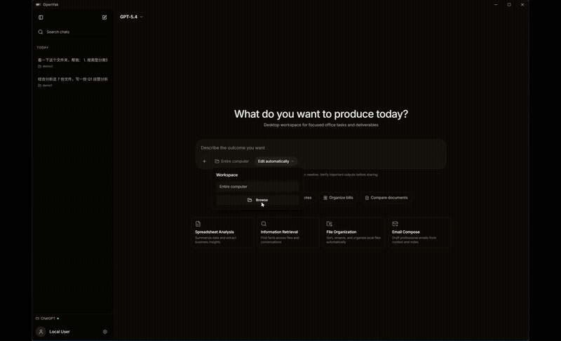

# OpenYak

<p align="center">
  <a href="README.zh-CN.md"></a>
  <a href="https://github.com/openyak/desktop/actions/workflows/ci.yml"></a>
  <a href="https://github.com/openyak/desktop/stargazers"></a>
  <a href="https://github.com/openyak/desktop/blob/main/LICENSE"></a>
  <a href="https://github.com/openyak/desktop/releases/latest"></a>
  
  <a href="https://github.com/openyak/desktop/pulls"></a>
</p>

<p align="center">
  
</p>

**OpenYak is an open-source local AI agent that runs entirely on your desktop. It connects to 100+ models from 20+ providers, manages your files, and automates workflows — all without your data ever leaving your machine.**

---

## Why OpenYak

- **Organize 500 contracts without uploading a single file.** OpenYak runs on your desktop with direct access to your filesystem — your data never leaves your machine.

- **Switch from GPT to Claude in one click.** 100+ cloud models, 20+ API providers, or run fully offline with [Ollama](https://ollama.com). No lock-in.

- **Let AI handle the tedious work.** 20+ built-in tools — read, write, rename files, run commands, parse spreadsheets, draft documents — all locally.

- **Free to start, no credit card.** 1M tokens per week on free models. Premium models at API prices with zero markup.

## Download

| Platform | Architecture | Formats |
|----------|-------------|---------|
| macOS | Apple Silicon / Intel | .dmg, .app |
| Windows | x64 | .exe (NSIS installer) |
| Linux | x64 | .deb, .AppImage, .rpm |

> **[Download Latest Release](https://github.com/openyak/desktop/releases/latest)** or visit [open-yak.com/download](https://open-yak.com/download/)
>
> **Linux users**: See [LINUX.md](LINUX.md) for installation instructions, system requirements, and troubleshooting.

## Get Started

1. **Download** the installer for your platform from the table above
2. **Connect a model** — use free cloud models instantly, top up for premium models, bring your own API key from 20+ providers, or run fully local with [Ollama](https://ollama.com)
3. **Start working** — manage files, analyze local data, and generate office-ready outputs

## What You Can Do

**File Management** — Rename, sort, and clean up files across folders. Set up recurring tasks — daily inbox tidy, weekly download cleanup — and let Yak handle it on schedule.

**Document & Spreadsheet Creation** — Turn notes into formatted reports, spreadsheets with working formulas, and export-ready PDFs. AI generates the actual files — not just text you have to copy-paste and format yourself.

**Data Analysis** — Parse spreadsheets, CSVs, and documents on your machine. Spot trends, flag anomalies, and export reports — your data never leaves your device.

**Research & Synthesis** — Pull information from PDFs, local files, and the web. Summarize across sources, extract key points, and compile structured briefs — ready for review, not raw dumps.

Connect to 46+ services — Slack, Notion, GitHub, Figma, and more — through built-in connectors. Or add your own via MCP.

## Supported Providers

### Cloud (via API)

| Provider | Access | |
|----------|--------|-|
| OpenAI | BYOK | ⭐ Recommended |
| Anthropic | BYOK | ⭐ Recommended |
| Google | BYOK | |
| DeepSeek | BYOK | |
| Grok | BYOK | |
| Qwen | BYOK | ⭐ Recommended |
| Kimi | BYOK | |
| MiniMax | BYOK | ⭐ Recommended |

### Local (via Ollama)

Run any model available on [Ollama](https://ollama.com) — fully offline, auto-detected, with tool-calling support.

> **BYOK** = Bring Your Own Key. Use your own API key — no markup, no middleman.

## For Developers

**Tech Stack**: Tauri v2 (Rust) + Next.js 15 + FastAPI + SQLite

**Monorepo Structure**:

```
desktop-tauri/    Rust — desktop shell, system integration
frontend/         Next.js 15 — chat UI, state management, SSE streaming
backend/          FastAPI — agent engine, tool execution, LLM streaming, storage
```

**Quick Start**:

```bash
npm run dev:all    # Start backend (port 8000) + frontend (port 3000)
```

For full technical details, project structure, and development setup, see [frontend/README.md](frontend/README.md) and [backend/README.md](backend/README.md).

## FAQ

<details>
<summary>Does my data leave my machine?</summary>

No. All files, conversations, and memory are stored locally on your device. The only data sent externally is your prompt text when using a cloud model — and even that goes directly to the model provider's API. No telemetry, no analytics, no cloud storage.
</details>

<details>
<summary>Is it free to use?</summary>

Yes. OpenYak includes 1M tokens per week on free models through OpenRouter at no cost. For premium models, you pay OpenRouter's prices with zero markup. You can also bring your own API key from 20+ providers, or run fully offline with Ollama for free.
</details>

<details>
<summary>Can I use it offline?</summary>

Yes. Install Ollama, download a model, and OpenYak works completely offline. No internet connection required. OpenYak auto-detects your local Ollama models and supports full tool-calling with them.
</details>

<details>
<summary>What models are supported?</summary>

100+ cloud models via OpenRouter, 20+ BYOK providers with direct API keys, and any model available through Ollama for local inference. New models are available as soon as they launch. See the Supported Providers section above.
</details>

<details>
<summary>How is this different from ChatGPT or Claude.ai?</summary>

OpenYak runs on your desktop with direct access to your local files and system. It can read, write, and organize your files, execute commands, and automate workflows — all while keeping your data on your machine. Web-based assistants cannot access your local filesystem.
</details>

## Community

- **Questions & Discussions** — [GitHub Discussions](https://github.com/openyak/desktop/discussions)
- **Bug Reports** — [GitHub Issues](https://github.com/openyak/desktop/issues)
- **Contributing** — [CONTRIBUTING.md](CONTRIBUTING.md) — PRs and feedback welcome

## Star History

If OpenYak is useful to you, consider giving it a star — it helps others discover the project.

<a href="https://star-history.com/#openyak/desktop&Date">
 <picture>
   <source media="(prefers-color-scheme: dark)" srcset="https://api.star-history.com/svg?repos=openyak/desktop&type=Date&theme=dark" />
   
 </picture>
</a>

## License

[AGPL-3.0](LICENSE)
