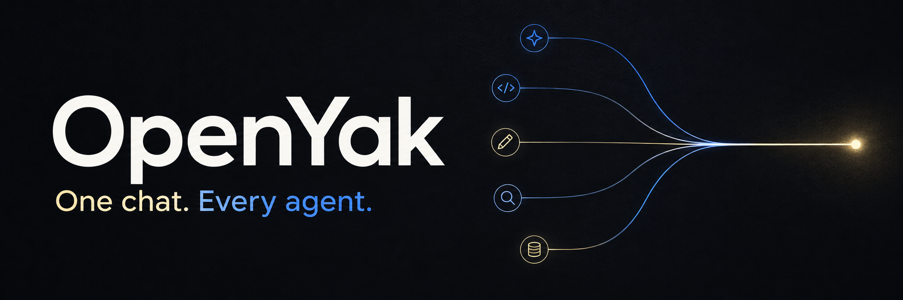

<p align="center"></p>

<p align="center">
  <a href="README.zh-CN.md">简体中文</a> · <a href="#run-locally">Run locally</a> · <a href="docs/native-agent-runtime.md">Runtime architecture</a> · <a href="CONTRIBUTING.md">Contribute</a>
</p>
<p align="center">
  
  <a href="LICENSE"></a>
</p>

**Your agents. Your conversation. One desktop workspace.**

OpenYak is a local desktop GUI for Codex and Claude Code. Keep the conversation, inspect the files, and work alongside your agent in a shared browser—without making the terminal your workspace.

> **This is v2, on `main`, and still alpha.** The original v1 is preserved on [`legacy/v1`](https://github.com/openyak/openyak/tree/legacy/v1) and in the [v1.5.0 release](https://github.com/openyak/openyak/releases/tag/v1.5.0). OpenYak integrates supported runtime interfaces; it does not reproduce every private feature of Codex Desktop or Claude Desktop.

## See the work, not just the answer


*Real OpenYak v2, dark mode. The fictional Orbit project is isolated demo data; Codex generated the report during capture.*

- **A conversation that stays yours.** Projects, tasks, and transcripts live locally. Switch providers within a task; OpenYak replays conversation context, not a provider's private internal state.
- **Native runtimes by default.** Codex App Server and Claude Agent SDK drive the agents. ACP remains an explicit compatibility option.
- **Files you can actually open.** Persistent tabs for Markdown, HTML, PDF, DOCX, and syntax-highlighted code.
- **Visible progress and decisions.** Streaming activity, runtime-reported subagents, scoped approvals, and structured questions.
- **A browser you can share.** Watch the agent, take control of the same page, then return control.
- **A desktop home.** Light and dark appearance, resizable workbench panels, a macOS Dock icon, and a menu-bar shortcut.

## Files are part of the conversation


Open file references directly from a response. Read Markdown as a document, preview sandboxed HTML, view PDFs and DOCX documents, or inspect code with highlighting and line numbers. Opening another file keeps existing tabs available.

The runtime boundary normalizes supported structured artifact and file outputs; the frontend does not need to guess tool names or turn arbitrary code blocks into artifacts. Ordinary file references are resolved through a separate file-opening path.

*The dashboard above is a hand-authored fixture rendered by the real app—not a generated screenshot or a claim that the agent built the dashboard.*

## Pick the runtime, keep the workspace


Use your existing provider authentication. Choose the models and session options the runtime exposes, without copying private Desktop system prompts into OpenYak.

| Provider | Default integration | Optional compatibility path |
| --- | --- | --- |
| Codex | Native App Server over stdio | Codex ACP adapter |
| Claude Code | Claude Agent SDK driving its CLI | Claude ACP adapter |

Model availability, usage limits, and provider features depend on your account and installed runtime versions. OpenYak does not supply model access.

## Browse together


The shared browser uses Playwright MCP and a dedicated Chrome session. The agent and the user operate the same page. Taking control blocks new agent browser actions and waits for in-flight work; resuming returns browser access without sending another chat prompt.

The panel uses lossless HiDPI frames. It is a shared remote view, not an embedded native browser or a promise of 60 fps. The pictured flow was exercised through Codex in the real GUI. External computer-use tools and native desktop control are separate capabilities; this screenshot does not certify those integrations.

Read the [shared-browser architecture and boundaries](docs/shared-browser.md).

## Run locally

Prerequisites: **Node 26**, **Rust 1.90** (`mise install` installs the pinned toolchains), and an existing [Codex](https://github.com/openai/codex) and/or [Claude Code](https://code.claude.com/docs/en/overview) sign-in. Install Google Chrome to use the shared browser.

```bash
git clone https://github.com/openyak/openyak.git
cd openyak
npm install
npm run dev
```

This builds the Rust core and launches Electron with hot reload. Agent dependencies are pinned in the app; authentication remains yours. `OPENYAK_CODEX_BIN` and `OPENYAK_CLAUDE_BIN` can select compatible local CLI binaries—see the [runtime documentation](docs/native-agent-runtime.md).

For an isolated test instance, set `OPENYAK_DATA_DIR` to a new, empty directory. To opt into ACP, use `OPENYAK_AGENT_TRANSPORT=acp`; native host integrations such as the shared browser are not automatically available on that path.

## Under the hood

```text
app/   Electron + React — chat, file workbench, native workers, host integrations
core/  Rust + SQLite   — projects, tasks, transcripts, normalized runtime events
docs/                  — architecture, contracts, and integration boundaries
```

OpenYak stores its conversation data locally. That does not mean offline inference: provider requests and browser navigation can use the network.

See the [native runtime design](docs/native-agent-runtime.md), [app/core protocol](docs/core-protocol.md), and [screenshot provenance and reproduction guide](docs/images/README.md).

### Alpha boundaries

Packaged installers, broader agent support, and Linux/Windows GUI validation are still work in progress. Runtime-reported subagents are not a complete workflow-orchestration UI. Claude integration exists, but the browser screenshots here validate Codex, not a Claude browser acceptance run. Private Desktop-only tools and full computer-use parity are not guaranteed.

## Contribute

Try a real task, switch agents, inspect the output, and tell us what breaks. See [CONTRIBUTING.md](CONTRIBUTING.md).

```bash
npm run check
npm run build
```

The repository's CI workflow has been removed; run these checks locally before submitting changes.

## License

[Apache-2.0](LICENSE).
