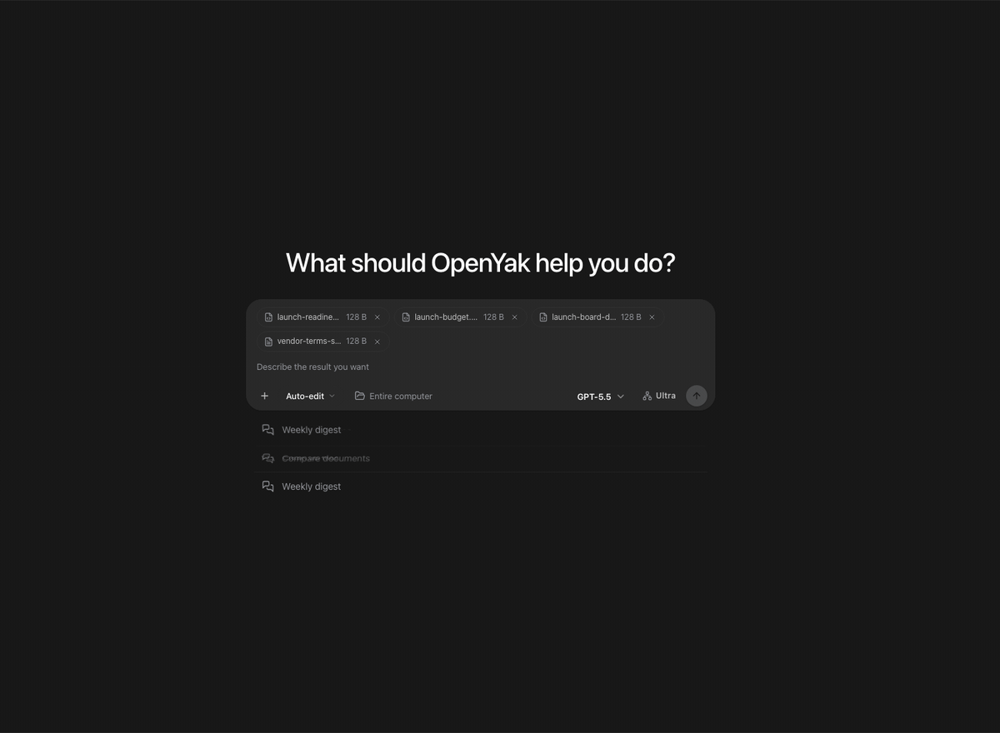
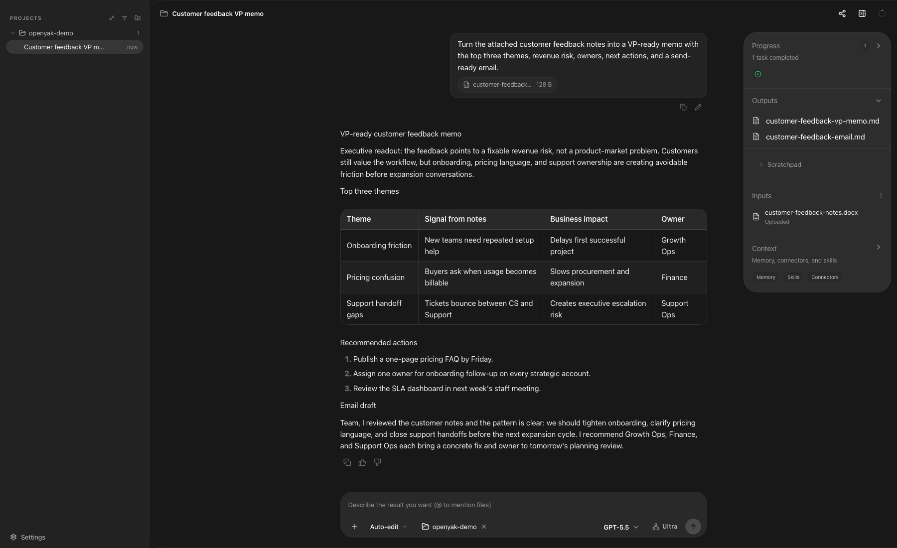
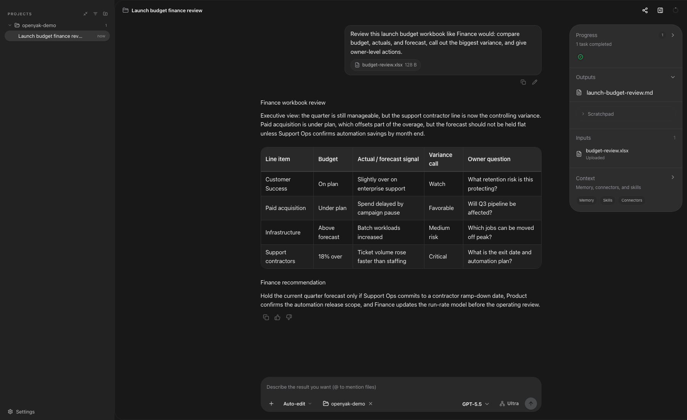
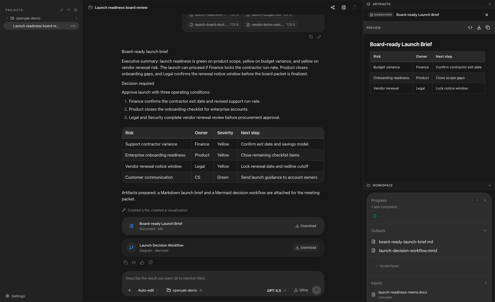
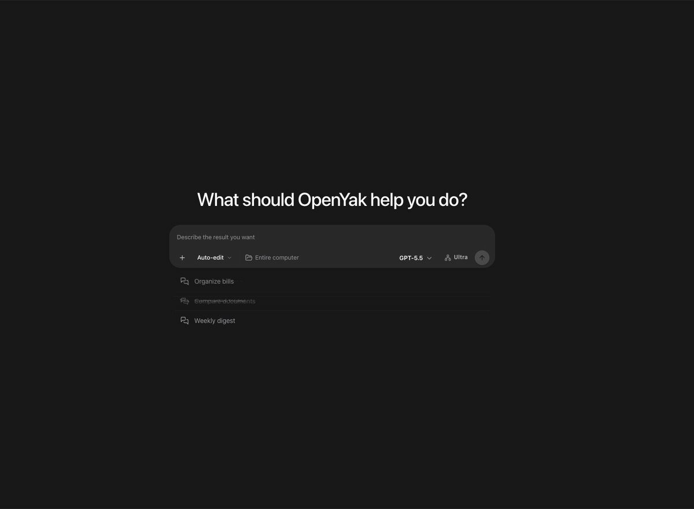
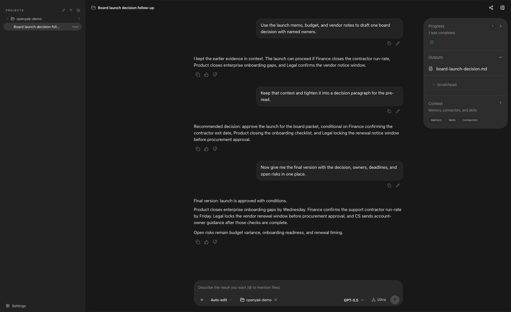
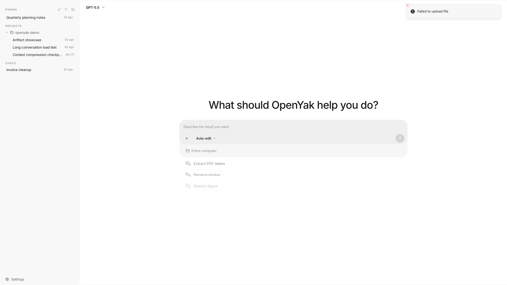

# OpenYak

<p align="center">
  <a href="README.md"></a>
  <a href="https://github.com/openyak/openyak/actions/workflows/ci.yml"></a>
  <a href="https://github.com/openyak/openyak/stargazers"></a>
  <a href="https://github.com/openyak/openyak/blob/main/LICENSE"></a>
  <a href="https://github.com/openyak/openyak/releases/latest"></a>
  
  <a href="https://github.com/openyak/openyak/pulls"></a>
</p>

<p align="center">
  
</p>

<h3 align="center">把文件、对话和混乱办公上下文，变成真正可交付的本地 AI 工作台。</h3>

<p align="center">
  读取本地文件、对比表格、审阅 deck、综合 PDF、生成 artifact、延续长对话，并把工作留在你的设备上。
</p>

---

## 为什么选择 OpenYak

OpenYak 不是只用来问一句话的聊天框，而是为真实办公动线设计的本地工作台。

- **直接处理真实文件。** 上传 DOCX、XLSX、PPTX、PDF、CSV 和本地项目上下文，生成 brief、表格、follow-up、计划和可复用 artifact。
- **同一个线程走完整流程。** 先分析文件，再继续生成 RACI、follow-up 邮件、会议 agenda，不需要反复重讲背景。
- **在 macOS 本地运行模型。** OpenYak v2 围绕 Apple Silicon 上的 [Rapid-MLX](https://github.com/raullenchai/Rapid-MLX) 构建——通过 Homebrew 或 pip 安装一次，然后让 OpenYak 指向 `http://localhost:8000/v1`。需要其他推理服务，使用 Custom Endpoint 模式。
- **默认本地优先。** 文件、对话、记忆和生成结果都存储在本机。v2 没有托管账户、没有云端代理——模型调用直接发给你配置的端点。
- **可以从手机访问桌面 AI。** 开启远程访问后扫码连接，通过安全 tunnel 把任务发给桌面端执行。

## 它解决什么问题

| 你让 OpenYak 做什么 | 它应该交付什么 |
|---------------------|----------------|
| 阅读一份长 memo | 高管简报、风险、owner、下一步行动和可直接发送的邮件 |
| 分析一个 workbook | Budget / actual variance、驱动因素、异常和财务会议口径 |
| 审阅一份 deck | 每页叙事、证据缺口、speaker notes 和最后的 decision ask |
| 综合多份文件 | 把 memo、预算表、deck、PDF 对齐成一份 board brief |
| 在同一线程继续追问 | RACI、30 天计划、agenda 和 follow-up 草稿 |
| 遇到错误 | 上传、鉴权、文件解析失败时给出清楚的恢复路径 |

## 真实办公 Workflow

### 从 Memo 到高管简报

OpenYak 可以把很长的 memo 整理成给管理层、团队同步或 follow-up 邮件使用的结构化 brief。

<p align="center">
  
</p>

<p align="center">
  
</p>

### 从表格到财务口径

表格不应该只被截图摘要。你可以要求 OpenYak 分析预算差异、forecast 风险、owner 级行动项，以及可以直接拿去开会的财务口径。

<p align="center">
  
</p>

### 从多文件到 Artifact

OpenYak 可以在同一个线程里综合多份文件，并在右侧 artifact panel 打开可复用的 brief、计划、图表和结构化输出。

<p align="center">
  
</p>

### 长对话与自动压缩

真实办公任务很少一轮结束。OpenYak 支持连续追问、修订、长线程保留上下文，让任务从分析自然推进到执行。

<p align="center">
  
</p>

<p align="center">
  
</p>

### 错误恢复

专业产品不能只展示成功路径。上传失败、输入缺失、文件解析失败时，界面应该保留 composer 可用，并告诉用户下一步怎么恢复。

<p align="center">
  
</p>

## 下载

| 平台 | 架构 | 格式 |
|------|------|------|
| macOS | Apple Silicon | `.dmg`, `.app` |

> [下载最新版本](https://github.com/openyak/openyak/releases/latest) 或访问 [open-yak.com/download](https://open-yak.com/download/)。
>
> v2.0.0 **仅支持 macOS（Apple Silicon）**。Windows 和 Linux 构建已被取消——背景见 [ADR-0011](docs/adr/0011-v2-macos-only-rapid-mlx-pivot.md)。这两个平台的 v1.x 安装包仍保留在 [releases 页](https://github.com/openyak/openyak/releases) 但不再更新。

## 快速开始

1. **安装 OpenYak。** 下载最新的 macOS 版本。
2. **安装 [Rapid-MLX](https://github.com/raullenchai/Rapid-MLX)。** `brew install raullenchai/rapid-mlx/rapid-mlx` 或 `pip install rapid-mlx`，然后在终端运行 `rapid-mlx serve <模型>`。或者跳过这一步，使用 Custom Endpoint 模式指向其他 OpenAI 兼容服务。
3. **打开 设置 → Providers** 并确认 OpenYak 检测到本地端点 `http://localhost:8000/v1`。
4. **新建会话并上传真实文件。**
5. **直接说你要的交付物。** 比如 brief、行动计划、RACI、邮件、表格或 artifact。
6. **检查结果并继续追问。** 在同一个线程里继续从分析推进到执行。

示例 prompt：

```text
请阅读我上传的文件，整理成一份给团队同步用的简洁 brief：
先列三条关键结论，再列风险、负责人和下一步行动。
最后写一封可以直接发给团队的 follow-up 邮件。
```

## 支持的模型提供商

OpenYak v2 提供两种模型接入方式。没有托管账户、没有云端代理、不内置任何云服务商目录——背景见 [ADR-0011](docs/adr/0011-v2-macos-only-rapid-mlx-pivot.md)。

| 模式 | 说明 |
|------|------|
| Rapid-MLX（本地） | Apple Silicon 上的推荐运行时。通过 Homebrew 或 pip 安装；OpenYak 自动检测 CLI 并连接 `http://localhost:8000/v1`。 |
| Custom Endpoint | 任何 OpenAI 兼容的 base URL——vLLM、llama.cpp server、自管理的 Ollama 实例、自建网关，或局域网内同事的 MLX 主机。 |

## 核心能力

- **文件理解：** office 文档、表格、演示文稿、PDF、CSV、本地文件夹和生成的 artifact。
- **Artifact 工作区：** 可复用 Markdown brief、表格、流程图、清单和结构化输出。
- **工具执行：** 读取、写入、重命名、整理和自动化文件，并由用户控制权限。
- **长上下文任务：** 从分析到计划再到 follow-up，不需要重新开始。
- **远程访问：** 通过二维码和 Cloudflare Tunnel 从手机连接桌面端。
- **自动化任务：** 定时清理、报告、文件整理和重复工作流。
- **隐私控制：** 本地存储、无托管账户，通过 Rapid-MLX 实现本地优先的模型服务。

## 开发者

**技术栈：** Tauri v2、Rust、Next.js 15、FastAPI、SQLite

**Monorepo 结构：**

```text
desktop-tauri/    Rust 桌面外壳和系统集成
frontend/         Next.js 聊天 UI、设置、artifact、SSE 流式传输
backend/          FastAPI agent 引擎、工具执行、LLM 流式传输、存储
```

**快速启动：**

```bash
npm run dev:all
```

这会启动后端 `8000` 端口和前端 `3000` 端口。更完整的开发说明请看 [frontend/README.md](frontend/README.md) 和 [backend/README.md](backend/README.md)。

## FAQ

<details>
<summary>我的数据会离开本机吗？</summary>

文件、对话、记忆和生成的 artifact 都存储在本机。v2 没有托管账户和云端代理——模型调用直接发到你配置的端点（默认是本机的 Rapid-MLX，或你设置的任意 Custom Endpoint URL）。如果你指向一个远程端点，prompt 和上下文当然会发送过去。
</details>

<details>
<summary>需要 OpenYak 账号吗？</summary>

不需要。v2 完全移除了托管账户。你只需要一个 OpenAI 兼容的模型端点供 OpenYak 接入——默认就是本地安装的 Rapid-MLX。
</details>

<details>
<summary>之前的 OpenYak 免费额度 / 云端代理怎么处理？</summary>

`api.open-yak.com` 上的托管代理将在 v2.0.0 发布后 30 天关闭。现有 v1 用户会收到应用内通知和包含迁移说明的邮件。v2 仅本地优先——背景见 [ADR-0011](docs/adr/0011-v2-macos-only-rapid-mlx-pivot.md)。
</details>

<details>
<summary>Windows 和 Linux 怎么办？</summary>

v2 仅支持 macOS（Apple Silicon）。Windows 和 Linux 的 v1.x 安装包仍保留在 [releases 页](https://github.com/openyak/openyak/releases) 但不再更新。背景见 [ADR-0011](docs/adr/0011-v2-macos-only-rapid-mlx-pivot.md)。
</details>

<details>
<summary>和 ChatGPT 或 Claude.ai 有什么区别？</summary>

OpenYak 运行在你的 Mac 上，围绕本地文件、artifact、工具和连续工作流设计。网页版聊天助手很适合问答，OpenYak 更像一个可以处理文件和重复办公任务的本地工作台。
</details>

<details>
<summary>可以离线使用吗？</summary>

可以。安装 Rapid-MLX，用 `rapid-mlx serve <模型>` 拉起一个模型，OpenYak 即可完全离线运行。
</details>

<details>
<summary>远程访问怎么工作？</summary>

在设置里开启远程访问，扫描二维码即可打开移动端网页。OpenYak 通过 Cloudflare Tunnel 和 token-based authentication 连接，不需要端口转发。
</details>

## 社区

- **提问与讨论：** [GitHub Discussions](https://github.com/openyak/openyak/discussions)
- **Bug 反馈：** [GitHub Issues](https://github.com/openyak/openyak/issues)
- **参与贡献：** [CONTRIBUTING.md](CONTRIBUTING.md)

## 许可证

[MIT](LICENSE)
