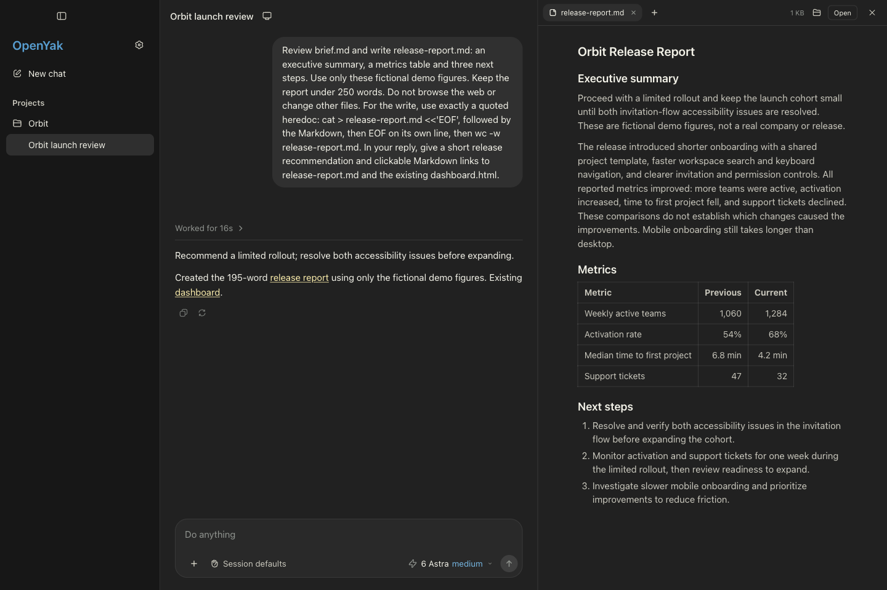
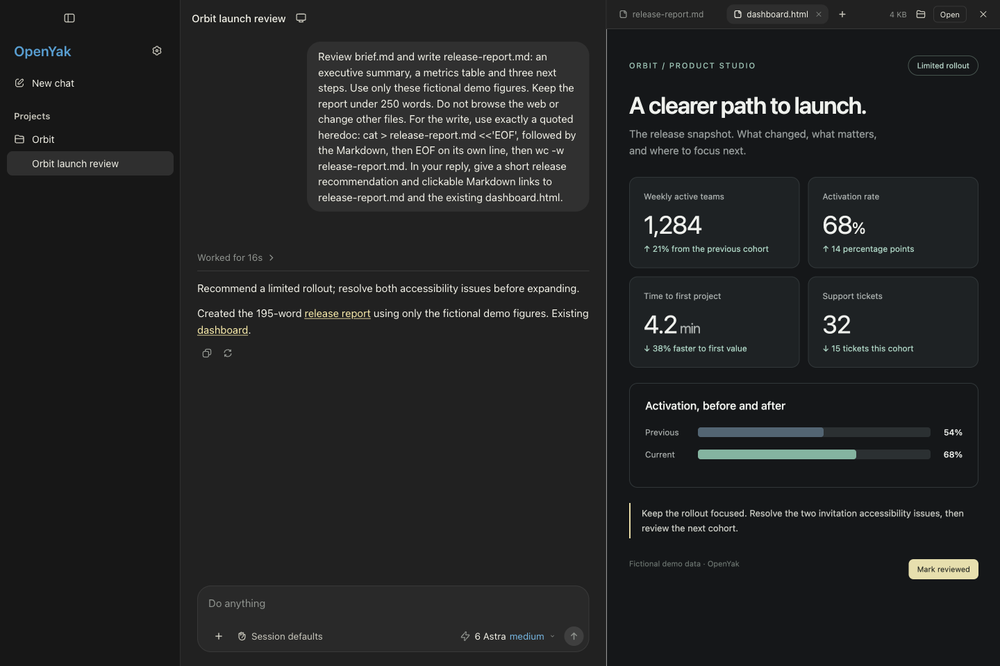
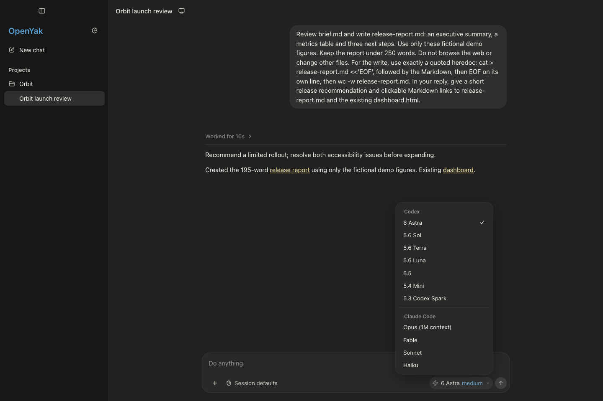
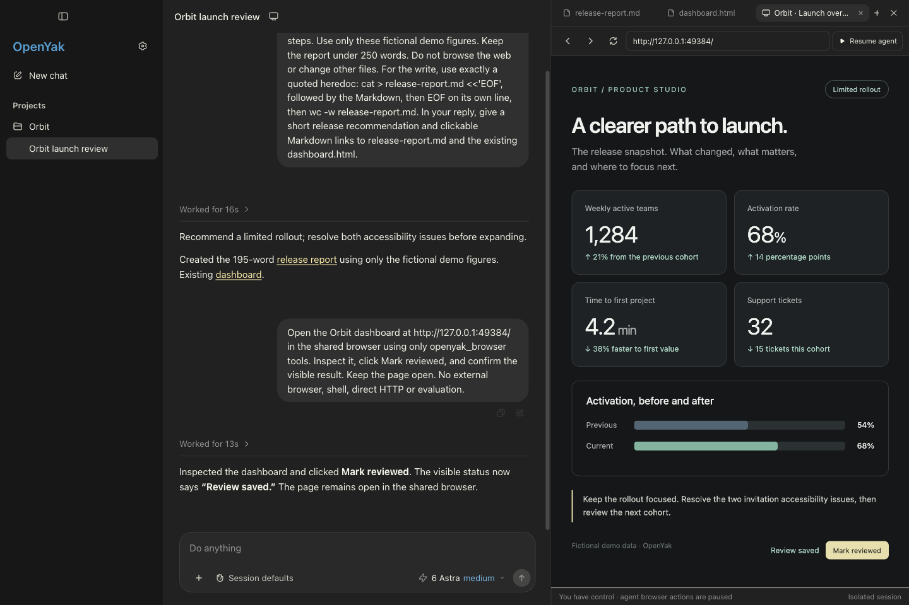

<p align="center"></p>

<p align="center"><a href="README.md">English</a> · <a href="#本地运行">本地运行</a> · <a href="docs/native-agent-runtime.md">运行时架构</a> · <a href="CONTRIBUTING.md">参与贡献</a></p>
<p align="center"> <a href="LICENSE"></a></p>

**你的 Agent，你的对话，一个桌面工作区。**

OpenYak 是 Codex 和 Claude Code 的本地桌面 GUI。保留对话、查看文件、在共享浏览器里与 Agent 协作，不必把终端当作整个工作区。

> **`main` 是 v2，目前仍处于 alpha 阶段。** 原版 v1 保留在 [`legacy/v1`](https://github.com/openyak/openyak/tree/legacy/v1) 分支和 [v1.5.0 release](https://github.com/openyak/openyak/releases/tag/v1.5.0)。OpenYak 对接公开的运行时接口，不承诺复刻 Codex Desktop 或 Claude Desktop 的全部私有能力。

## 不只看回答，也看工作成果



*真实 OpenYak v2 深色界面。Orbit 是隔离环境中的虚构演示项目，报告由真实 Codex 在截图过程中生成。*

- **对话属于你。** 项目、任务和记录保存在本地。任务内切换 Agent 时传递对话上下文，不是提供商私有的内部状态。
- **默认使用原生运行时。** 对接 Codex App Server 和 Claude Agent SDK，ACP 作为显式兼容选项保留。
- **文件真正可打开。** Markdown、HTML、PDF、DOCX 和语法高亮代码使用持久多标签预览。
- **进度和决策可见。** 流式活动、运行时报告的子 Agent、限定范围的授权请求和结构化提问。
- **共享同一个浏览器。** 查看 Agent 操作，接管页面，再交还控制权。
- **桌面体验。** 深浅色主题、可调整的工作区面板、macOS Dock 图标和菜单栏快捷入口。

## 文件也是对话的一部分



直接点击回答中的文件引用：Markdown 以文档呈现，HTML 在沙箱中预览，PDF 和 DOCX 可阅读，代码具有语法高亮和行号。打开其他文件不会覆盖已有标签。

运行时边界统一处理支持的结构化 Artifact 和文件输出，前端不必猜工具名，也不会把任意代码块当作 Artifact。普通文件引用通过独立的文件打开流程解析。

*图中仪表盘是手工编写的演示文件，由真实 App 渲染；不是生成的产品截图，也不代表 Agent 生成了该仪表盘。*

## 换 Agent，不换工作区



沿用提供商已有登录，选择运行时实际暴露的模型和会话选项，不把私有 Desktop system prompt 复制到 OpenYak。

| 提供商 | 默认接入 | 可选兼容路径 |
| --- | --- | --- |
| Codex | 原生 App Server，stdio 通信 | Codex ACP adapter |
| Claude Code | Claude Agent SDK 驱动 CLI | Claude ACP adapter |

模型可用性、额度和功能取决于你的账号与运行时版本，OpenYak 不提供模型使用权限。

## 一起操作浏览器



通过 Playwright MCP 和独立 Chrome 会话，Agent 与用户操作同一个页面。接管时阻止新的 Agent 浏览器操作，并等待正在执行的操作结束；恢复时交还浏览器权限，不额外发送聊天消息。

面板使用无损 HiDPI 帧，是共享远程视图，不是原生嵌入式浏览器，也不承诺 60 fps。图中流程使用 Codex 在真实 GUI 内验证。外部 Computer Use 工具和原生桌面控制是其他能力，这张截图不代表它们均已验证。

详见[共享浏览器架构与边界](docs/shared-browser.md)。

## 本地运行

准备 **Node 26**、**Rust 1.90**（可用 `mise install` 安装固定工具链），并登录 [Codex](https://github.com/openai/codex) 和/或 [Claude Code](https://code.claude.com/docs/en/overview)。共享浏览器需要 Google Chrome。

```bash
git clone https://github.com/openyak/openyak.git
cd openyak
npm install
npm run dev
```

命令会构建 Rust core 并启动支持热更新的 Electron App。应用固定 Agent 依赖版本，登录由你管理。可通过 `OPENYAK_CODEX_BIN` 和 `OPENYAK_CLAUDE_BIN` 指定兼容的本地 CLI，详见[运行时文档](docs/native-agent-runtime.md)。

隔离测试时，将 `OPENYAK_DATA_DIR` 指向新的空目录。使用 `OPENYAK_AGENT_TRANSPORT=acp` 可切换到 ACP；共享浏览器等原生宿主集成不会自动注入此路径。

## 技术结构

```text
app/   Electron + React — 对话、文件工作区、原生 worker、宿主集成
core/  Rust + SQLite   — 项目、任务、对话记录、统一运行时事件
docs/                 — 架构、协议和集成边界
```

对话数据本地存储不等于离线推理：提供商请求和浏览器访问仍可能使用网络。

参阅[原生运行时设计](docs/native-agent-runtime.md)、[App/Core 协议](docs/core-protocol.md)、[截图来源与复现说明](docs/images/README.md)。

Logo、Banner 和视觉设计规范统一收录在 [OpenYak brandkit](brandkit/README.md)。

### Alpha 阶段的边界

安装包、更多 Agent 支持以及 Linux/Windows GUI 验证仍在推进。子 Agent 活动展示不等于完整工作流编排 UI。Claude 已接入，但本页浏览器截图验证的是 Codex，不是 Claude 浏览器验收。私有 Desktop 工具和完整 Computer Use 能力对齐不作保证。

## 参与贡献

用它完成真实任务、切换 Agent、检查成果，反馈遇到的问题。详见 [CONTRIBUTING.md](CONTRIBUTING.md)。

```bash
npm run check
npm run build
```

[v2 CI 工作流](docs/ci.md) 检查运行时协议、生产构建及真实桌面/浏览器回归，不调用付费模型。纯文档改动跳过重量级检查。

## 许可证

[Apache-2.0](LICENSE)。
