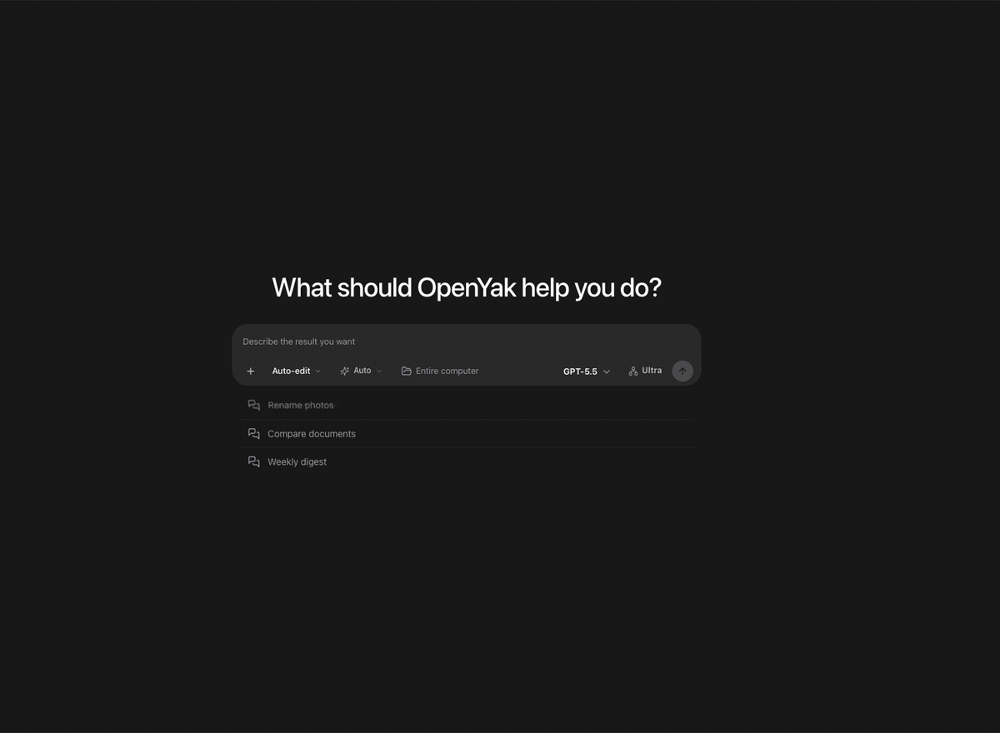
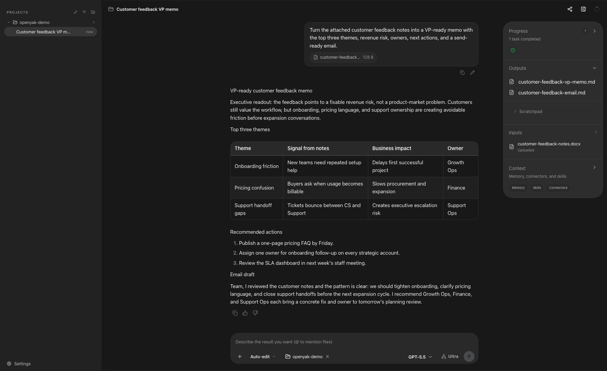
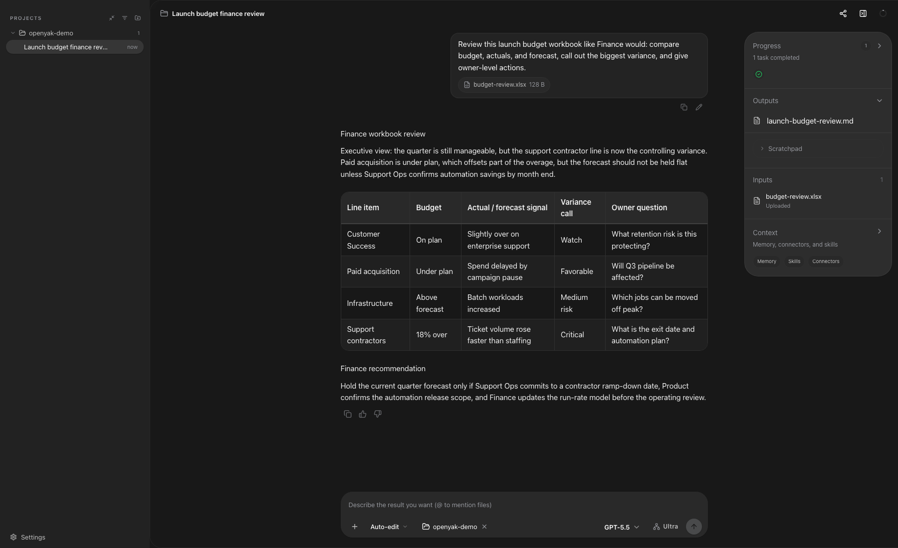
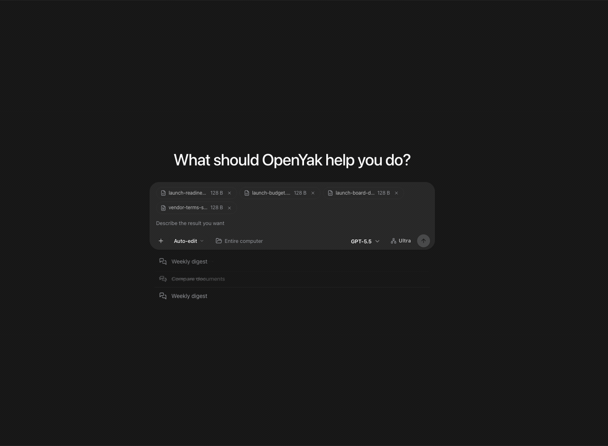
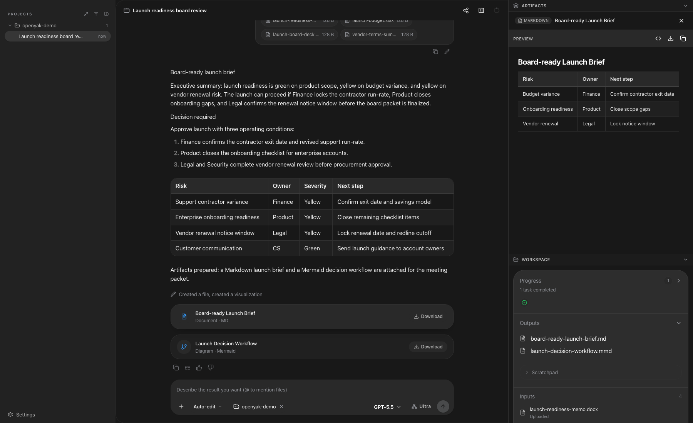
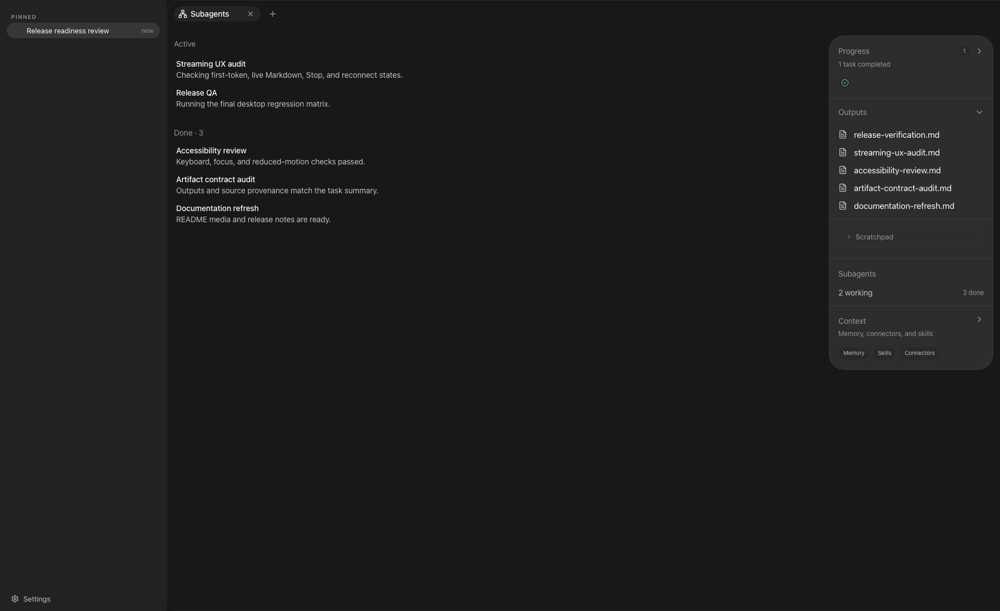
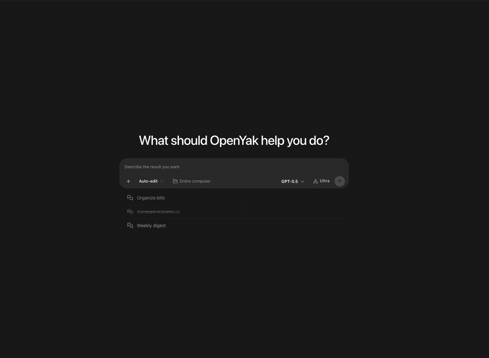
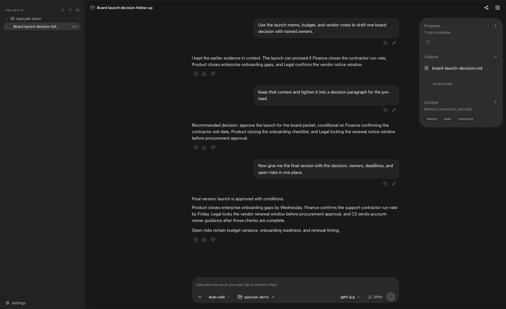

# OpenYak

<p align="center">
  <a href="README.md"></a>
  <a href="https://github.com/openyak/openyak/actions/workflows/ci.yml"></a>
  <a href="https://github.com/openyak/openyak/stargazers"></a>
  <a href="https://github.com/openyak/openyak/blob/main/LICENSE"></a>
  <a href="https://github.com/openyak/openyak/releases/latest"></a>
  
  <a href="https://github.com/openyak/openyak/pulls"></a>
</p>

<p align="center">
  
</p>

<h3 align="center">面向可靠工具调用模型的本地优先 Agent Runtime，以及构建在它之上的桌面工作台。</h3>

<p align="center">
  在自己的电脑上运行 agent，跨本地文件、原生应用和托管 Browser 工作，并按你的边界选择本地或云端模型。
</p>

---

## 为什么选择 OpenYak

OpenYak 不是另一个必须登录的云端工作区，而是一个运行在你电脑上的本地 AI agent。

- **不需要 OpenYak 账号。** 安装应用，选择本地模型或自带 provider key，就可以开始工作；没有登录、账单、席位或充值流程。
- **本地优先的 agent runtime。** 文件、对话、记忆、生成的 artifact、工具权限和工作流状态都留在你的设备上。
- **直接处理真实文件。** 上传 DOCX、XLSX、PPTX、PDF、CSV 和本地项目上下文，生成 brief、表格、follow-up、计划和可复用 artifact。
- **让 Agent 使用应用和网站。** 在共享的 Computer 或 Browser 实时画面中观察执行，敏感步骤可以随时接管，完成后再把控制权交还给 Agent。
- **同一个线程走完整流程。** 先分析文件，再继续生成 RACI、follow-up 邮件、会议 agenda，不需要反复重讲背景。
- **自由选择模型边界。** 通过 [Rapid-MLX](https://github.com/raullenchai/Rapid-MLX) 或 [Ollama](https://ollama.com) 本地运行模型；需要云端模型时，再使用自己的 OpenRouter、OpenAI、Anthropic、Google 等 provider key。
- **从其他设备访问桌面 agent。** 开启远程访问后扫码连接，通过安全 tunnel 把任务发给你的电脑执行。

## Computer Use：Agent 执行，你掌握控制权

> **[v1.5 Release Candidate](https://github.com/openyak/openyak/releases/tag/v1.5.0-rc.2) 新功能。** 原生 Computer 当前面向 macOS 和 Windows；OpenYak 其他能力继续支持 Linux，但 Linux Computer Use 不属于 v1.5 release gate。

OpenYak 提供两个为 Agent 专门设计、并与用户共享的工作区，而不是把所有界面都退化成盲目的坐标点击：

- **原生 Computer：** 优先通过 accessibility element 操作 macOS 和 Windows 应用；工作区提供应用实时画面、目标应用切换，并只在必要时回退到坐标输入。
- **托管 Browser：** 在 OpenYak 独立浏览器 profile 中使用标签页、页面元素、截图、对话框和浏览器诊断能力完成网站任务。
- **共享控制：** 实时观察 Agent 工作；点击 **Take over** 后可以自己点击、输入和滚动，再点击 **Return to Agent** 延续同一个任务。
- **范围明确的权限：** 原生应用按 app 授权，Browser 按网站 origin 授权；凭据始终由用户输入，重要操作仍需单独确认；托管 Browser 不会复用你日常登录的 Chrome profile。

在输入框的 **Use** 菜单选择 **Computer**，会把任务固定到原生应用；选择 **Browser**，会固定到托管 Browser；选择 **Auto**，则由 Agent 为当前一轮选择合适工具。输入框会持续显示所选模式；每次 Computer 或 Browser 工具观察也会先标明当前界面，再由你打开对应的实时工作区。例如：

```text
检查发布清单，切换到备忘录，然后在 Browser 中核对 Release 页面。
始终把实时工作区展示给我；我接管后，再从当前状态继续。
```

上方 demo 使用了已经授权的示例 app 和网站，但展示的是完整任务时序：用户发送消息、Agent 流式回复、Computer 与 Browser 工具观察、打开实时工作区、用户接管和交还，最后由 Agent 给出核验结果。正常使用仍会显示真实授权流程。macOS 需要 Accessibility 和 Screen Recording 权限；Windows 需要目标应用保持在当前桌面可见，UAC secure desktop 不在控制范围内。选择云端模型时，完成任务所需的相关应用或页面状态会作为模型上下文直接发送给该 provider。

完整的[架构、支持动作、安全模型和平台状态](docs/computer-use.md)见 Computer Use 文档。

## 它解决什么问题

| 你让 OpenYak 做什么 | 它应该交付什么 |
|---------------------|----------------|
| 阅读一份长 memo | 高管简报、风险、owner、下一步行动和可直接发送的邮件 |
| 分析一个 workbook | Budget / actual variance、驱动因素、异常和财务会议口径 |
| 审阅一份 deck | 每页叙事、证据缺口、speaker notes 和最后的 decision ask |
| 综合多份文件 | 把 memo、预算表、deck、PDF 对齐成一份 board brief |
| 操作原生应用或网站 | 打开一个共享实时工作区，由 Agent 执行，并允许你随时接管 |
| 拆给多个 agent 并行处理 | 多个 child-agent task、独立会话链接和汇总结果 |
| 在同一线程继续追问 | RACI、30 天计划、agenda 和 follow-up 草稿 |
| 遇到错误 | 上传、鉴权、文件解析失败时给出清楚的恢复路径 |

## 真实办公 Workflow

### 从 Memo 到高管简报

OpenYak 可以把很长的 memo 整理成给管理层、团队同步或 follow-up 邮件使用的结构化 brief。

<p align="center">
  
</p>

<p align="center">
  
</p>

### 从表格到财务口径

表格不应该只被截图摘要。你可以要求 OpenYak 分析预算差异、forecast 风险、owner 级行动项，以及可以直接拿去开会的财务口径。

<p align="center">
  
</p>

### 从多文件到 Artifact

OpenYak 可以在同一个线程里综合多份文件，并在右侧 artifact panel 打开可复用的 brief、计划、图表和结构化输出。

<p align="center">
  
</p>

<p align="center">
  
</p>

### Ultra Agent Swarm

复杂任务开启 Ultra 后，像平常一样描述目标即可。父 Agent 会自主判断何时在持久化子 Session 中启动 2–4 个聚焦的 AgentRun，跟踪实时状态，在需要时交换输入，并在原任务中综合已持久化的结果。用户不需要配置 task-batch 表单。

父任务作用域内的 Subagents 视图会在同一个任务壳中整理 Active 和 Done 工作。你可以打开子会话 transcript，检查状态与输出，再返回父任务；Progress、Outputs、Subagents、Sources、Inputs 和 Context 始终关联到同一个任务。

<p align="center">
  
</p>

### 长对话与自动压缩

真实办公任务很少一轮结束。OpenYak 支持连续追问、修订、长线程保留上下文，让任务从分析自然推进到执行。

<p align="center">
  
</p>

<p align="center">
  
</p>

## 下载

| 平台 | 架构 | 格式 |
|------|------|------|
| macOS | Apple Silicon / Intel | `.dmg`, `.app` |
| Windows | x64 | `.exe` 安装包 |
| Linux | x64 | `.deb`, `.rpm` |

> [下载最新版本](https://github.com/openyak/openyak/releases/latest) 或访问 [open-yak.com/download](https://open-yak.com/download/)。
>
> 现在体验 Computer Use，请下载 [v1.5 Release Candidate](https://github.com/openyak/openyak/releases/tag/v1.5.0-rc.2)。
>
> Linux 用户可以查看 [LINUX.md](LINUX.md) 了解依赖、安装和排障说明。

## 快速开始

1. **安装 OpenYak。** 下载适合你系统的安装包。
2. **选择推理运行在哪里。** 用 Rapid-MLX / Ollama 在本地或离线运行；需要托管模型时，再连接 BYOK 云端 provider。
3. **新建会话。** 上传真实文件，或为交互任务选择 **Use → Computer / Browser**。
4. **直接说你要的交付物。** 比如 brief、行动计划、RACI、邮件、表格、artifact，或完成一个应用工作流。
5. **实时跟进执行。** 检查结果、按需接管，再在同一个线程里继续。

示例 prompt：

```text
请阅读我上传的文件，整理成一份给团队同步用的简洁 brief：
先列三条关键结论，再列风险、负责人和下一步行动。
最后写一封可以直接发给团队的 follow-up 邮件。
```

## 模型选项

### 本地优先

- **Rapid-MLX：** Apple Silicon macOS 用户可以在设置里启动、切换精选 MLX 模型。OpenYak 会连接 Rapid-MLX 在 `localhost` 暴露的 OpenAI-compatible API。
- **Ollama：** 通过 [Ollama](https://ollama.com) 运行任意本地模型。OpenYak 会自动检测本地模型，也可以在无网络环境下工作。
- **自定义本地 endpoint：** 如果你自己运行 OpenAI-compatible 模型服务，可以直接把 OpenYak 指向本地地址。

### 可选云端 Provider

| 提供商 | 接入方式 | 说明 |
|--------|----------|------|
| OpenRouter | BYOK | 使用自己的 OpenRouter API Key |
| OpenAI | BYOK | 使用自己的 API Key |
| Anthropic | BYOK | 使用自己的 API Key |
| Google | BYOK | Gemini 模型 |
| DeepSeek | BYOK | 直连提供商密钥 |
| Groq | BYOK | 高速托管推理 |
| Mistral | BYOK | 直连提供商密钥 |
| xAI | BYOK | Grok 模型 |
| Qwen | BYOK | 直连提供商密钥 |
| Kimi | BYOK | Moonshot 模型 |
| MiniMax | BYOK | 直连提供商密钥 |
| 智谱 | BYOK | 直连提供商密钥 |
| Together AI | BYOK | 直连提供商密钥 |
| DeepInfra | BYOK | 直连提供商密钥 |
| Cerebras | BYOK | 高速托管推理 |
| Cohere | BYOK | Command 模型 |
| Perplexity | BYOK | Sonar 模型 |
| Fireworks AI | BYOK | 直连提供商密钥 |
| Azure OpenAI | BYOK | 使用自己的 Azure 部署 |
| SiliconFlow | BYOK | 直连提供商密钥 |
| Xiaomi MiMo | BYOK | 直连提供商密钥 |
| ChatGPT | 订阅 | 在可用时使用现有 ChatGPT Plus、Pro、Team 或 Enterprise 方案 |

未列入上表的 provider，仍可通过自定义 OpenAI 兼容端点接入。云端和订阅路径都是可选项。OpenYak 不提供内置模型账号，也不代理模型流量；请求会从你的桌面端直接发往你配置的 provider。

## 核心能力

- **文件理解：** office 文档、表格、演示文稿、PDF、CSV、本地文件夹和生成的 artifact。
- **Artifact 工作区：** 可复用 Markdown brief、表格、流程图、清单和结构化输出。
- **工具执行：** 读取、写入、重命名、整理和自动化文件，并由用户控制权限。
- **Computer Use：** 共享的原生应用与托管 Browser 工作区，支持实时画面、范围授权、目标切换和用户接管。
- **长上下文任务：** 从分析到计划再到 follow-up，不需要重新开始。
- **远程访问：** 通过二维码和 Cloudflare Tunnel 从手机连接桌面端。
- **自动化任务：** 定时清理、报告、文件整理和重复工作流。
- **隐私控制：** 本地存储、无需 OpenYak 账号、BYOK provider、本地模型支持。

## Agent Runtime 工程实践

OpenYak 同时也是一个开源 ML systems 项目。桌面应用构建在一套持久化
Agent Runtime 之上，目标是让工具调用模型在访问本地资源时可观察、可恢复、
并受到清晰的安全边界约束。

- **Production engineering：** 持久化运行状态、可恢复 SSE、取消、有限重试和
  子任务故障隔离。
- **Tool execution：** 机器可读的工具 schema、参数校验、畸形调用修复、执行反馈
  和输出预算。
- **Permissions：** 分层 allow/ask/deny 规则、资源级授权、workspace 边界和
  secret-aware 权限展示。
- **Context：** 模型感知的 token budget、工具输出压缩、确定性 context collapse
  和持久化 LLM summary。
- **Cross-platform architecture：** macOS、Windows、Linux 上的 Tauri 与 Next.js，
  共用一套 FastAPI runtime 和本地/云端 provider contract。
- **Open-source adoption：** 公开 release、contributor、issue 和 star 与模型质量
  分开证明；模型质量只使用可复现评估结果。

从有代码证据的 [Agent Runtime 技术案例](AGENT_RUNTIME.md) 开始，然后查看
[模型训练与路由](MODEL_TRAINING.md)、[评估协议](EVALUATION.md)、
[Benchmark 规范](BENCHMARKS.md) 和 [Failure analysis](FAILURE_ANALYSIS.md)。

## 开发者

**技术栈：** Tauri v2、Rust、Next.js 15、FastAPI、SQLite

**Monorepo 结构：**

```text
desktop-tauri/    Rust 桌面外壳和系统集成
frontend/         Next.js 聊天 UI、设置、artifact、SSE 流式传输
backend/          FastAPI agent 引擎、工具执行、LLM 流式传输、存储
```

**快速启动：**

```bash
npm run dev:all
```

这会启动后端 `8000` 端口和前端 `3000` 端口。更完整的开发说明请看 [frontend/README.md](frontend/README.md) 和 [backend/README.md](backend/README.md)。

## FAQ

<details>
<summary>我的数据会离开本机吗？</summary>

文件、对话、记忆、生成的 artifact 和工作流状态都存储在本机。使用 Rapid-MLX、Ollama 或其他本地 endpoint 时，模型请求留在你的机器上。只有当你主动选择云端模型时，prompt 和相关上下文才会从桌面端直接发送给你配置的模型提供商。
</details>

<details>
<summary>需要 OpenYak 账号吗？</summary>

不需要。OpenYak 不需要账号、登录、账单资料、充值流程、团队工作区或托管 OpenYak 后端。使用云端 provider 时，你需要自己的 API Key 或已有订阅；不使用云端 provider 时，可以直接走本地模型。
</details>

<details>
<summary>和 ChatGPT 或 Claude.ai 有什么区别？</summary>

OpenYak 运行在你的桌面上，围绕本地文件、artifact、工具、权限和连续工作流设计。网页版聊天助手很适合问答，OpenYak 更像一个能查看文件、使用工具、把长任务留在你电脑上的本地 agent 工作台。
</details>

<details>
<summary>可以离线使用吗？</summary>

可以。在 Apple Silicon macOS 上，可以使用 Rapid-MLX 和已下载的 MLX 模型；在 macOS、Windows 或 Linux 上，可以安装 Ollama 并下载模型。之后 OpenYak 可以在不调用云端模型的情况下本地运行。
</details>

<details>
<summary>远程访问怎么工作？</summary>

在设置里开启远程访问，扫描二维码即可打开移动端网页。OpenYak 通过 Cloudflare Tunnel 和 token-based authentication 连接，不需要端口转发。
</details>

## 社区

- **提问与讨论：** [GitHub Discussions](https://github.com/openyak/openyak/discussions)
- **Bug 反馈：** [GitHub Issues](https://github.com/openyak/openyak/issues)
- **参与贡献：** [CONTRIBUTING.md](CONTRIBUTING.md)

## 许可证

[Apache-2.0](LICENSE)
