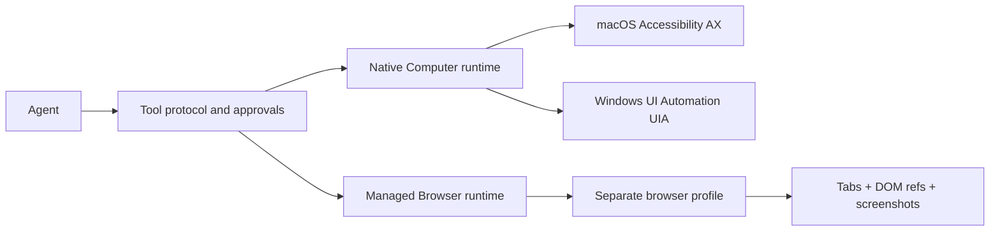

# OpenYak Computer Use and Browser

OpenYak exposes two independent, stateful capability surfaces. They are not a
single screenshot-and-coordinate macro.

## Architecture



The backend is the capability host because OpenYak's desktop architecture runs
all Agent and Tool logic in the local backend subprocess (ADR 0001). Tauri owns
the desktop shell and operating-system permission declarations. This preserves
the same product boundary as Codex Application—an app-managed runtime behind a
tool contract—without copying Codex's private `@oai/sky` implementation.

### Native Computer

1. Resolve an application by display name or stable identifier.
2. Read its AX/UIA hierarchy without requiring it to be frontmost.
3. Return semantic elements with stable session indices, roles, labels, values,
   state, bounds, selected text ranges, and the exact exposed actions,
   plus a window screenshot when the OS can capture one.
4. Prefer element actions (`click`, `set_value`, `type_text`, `select_text`,
   exact secondary actions, and four-direction page scrolling).
5. Return a per-session state diff after each action. A full state can be
   requested whenever an index becomes stale.

macOS uses Accessibility elements and targeted AX actions. Windows uses
Microsoft UI Automation patterns. Coordinates remain a last-resort visual
fallback; they are not the primary control path.

### Managed Browser

The `browser` tool launches Chrome (macOS) or Chrome/Edge (Windows) with a
dedicated OpenYak profile. It owns persistent tabs and exposes DOM element refs
across same-origin frames and open Shadow DOM, navigation/history, semantic and
coordinate input, drag/hover, clipboard isolation, dialogs, console/network
logs, adaptive state settling, and screenshots. Website automation therefore
does not depend on desktop focus or native Computer Use.

This profile is intentionally separate from the user's everyday signed-in
Chrome. A future Chrome-extension surface may explicitly control that existing
profile, but it must remain a distinct permission and session boundary.

## Relationship to Codex and Claude

The design follows the current application-level patterns rather than the older
provider API's raw screenshot loop:

| Capability | Codex Application pattern | OpenYak |
| --- | --- | --- |
| Native state | App-scoped accessibility state + screenshot | AX/UIA elements + screenshot |
| Native actions | Element index first, coordinates as fallback | Contract aligned: click/drag/value/type/key/scroll/select/secondary action |
| State continuity | Stateful runtime, adaptive wait, compact diffs | Stable per-session indices, adaptive wait, revisions and diffs |
| Browser | Independent managed Browser with tabs/DOM/CUA | Managed tabs, DOM + coordinate CUA, screenshots, logs, dialogs and clipboard |
| Existing Chrome | Separate extension surface | Kept separate; not impersonated by Computer |
| Permissions | App/site/action-scoped approvals | Per-app, per-origin and non-persistable action-time confirmations |

Primary references:

- [Codex app documentation](https://developers.openai.com/codex/app/)
- [OpenAI computer-use guide](https://developers.openai.com/api/docs/guides/tools-computer-use)
- [Claude computer-use tool](https://platform.claude.com/docs/en/agents-and-tools/tool-use/computer-use-tool)

## Safety model

- Native access is approved per application; Browser access is approved per
  website origin.
- OpenYak/ChatGPT, terminal apps, password managers, credential stores and
  common cryptocurrency apps are blocked from native Computer Use.
- Secure text fields are never returned through the semantic state tree.
- Browser URLs with embedded credentials, non-HTTP schemes and local files are
  rejected.
- The managed Browser does not reuse the user's normal Chrome profile.
- UI/page text is untrusted. Consequential actions use explicit `handoff`,
  action-time, pre-approved, or low-risk modes. Action-time confirmation cannot
  be remembered or bypassed by Auto mode.
- Old native and browser screenshots are removed from model context
  automatically; the latest state stays available for grounding.
- macOS still needs Accessibility and Screen Recording consent. Windows secure
  desktop/UAC remains intentionally outside the runtime.

## Supported actions

Native Computer:

`list_apps`, `get_app_state`, `click`, `drag`, `set_value`, `type_text`,
`press_key`, `scroll`, `select_text`, `perform_secondary_action`, `wait`.

Managed Browser:

`list_tabs`, `open`, `navigate`, `snapshot`, `screenshot`, `click`,
`coordinate_click`, `drag`, `hover`, `fill`, `type_text`, `press`,
`select_option`, `set_checked`, `scroll`, `clipboard_read`, `clipboard_write`,
`console_logs`, `network_log`, `dialog`, `back`, `forward`, `reload`,
`close_tab`, `wait`.

## Release verification

The normal backend suite uses deterministic runtime fakes. Release machines can
also execute the opt-in visible integration matrix:

```bash
cd backend
OPENYAK_RUN_COMPUTER_USE_INTEGRATION=1 .venv/bin/pytest -q \
  tests/test_tool/test_computer_macos_integration.py
OPENYAK_RUN_BROWSER_INTEGRATION=1 .venv/bin/pytest -q \
  tests/test_tool/test_browser_integration.py
```

On Windows (PowerShell), the same opt-in drives the Windows matrix:

```bash
cd backend
$env:OPENYAK_RUN_COMPUTER_USE_INTEGRATION=1; venv/Scripts/python -m pytest -q tests/test_tool/test_computer_windows_integration.py
```

The macOS test verifies real AX state, stable indices, a real window screenshot,
text selection with restoration, semantic page scrolling with restoration, and
adaptive waiting. The Windows test covers the same contract against a real
Notepad window: UIA state through the asyncio thread pool that ComputerTool
dispatches on, session-stable indices across a reflowed tree, a window capture
taken while another window covers the target, foreground acquisition for
synthetic input, value/text editing, selection offsets, page scrolling that
actually moves the viewport, adaptive settling, and executable-based blocking of
consoles. The Browser test launches real Chrome and covers managed tabs, DOM
refs, iframe and Shadow DOM interaction, form controls, screenshots, clipboard,
console/network inspection, coordinate fallback, and JavaScript dialog handling.

These matrices deliberately use no runtime fakes. The unit suites stub the OS,
which is why a Windows runtime that could not initialize COM on a worker thread,
never acquired the foreground, and captured the wrong window still passed CI.

## Platform support

- macOS: Accessibility AX for semantic app control; Core Graphics for window
  capture; managed Chrome for Browser.
- Windows: Microsoft UI Automation on a dedicated COM-initialized thread;
  `PrintWindow(PW_RENDERFULLCONTENT)` for DPI-aware capture of the window's own
  pixels rather than the screen region beneath it; managed Chrome or Edge for
  Browser.
- Linux is not a release gate yet.

### Windows specifics

- Element actions (`click` by index, `set_value`, `type_text`, `select_text`,
  `scroll`, `perform_secondary_action`) go through UIA patterns and do not
  require the target to be frontmost.
- `press_key`, `drag` and coordinate clicks are synthetic input, so the runtime
  first takes the foreground. Windows refuses `SetForegroundWindow` to a
  background process, so the runtime escalates through the documented sequence
  (foreground lock timeout, `AllowSetForegroundWindow`, `AttachThreadInput`,
  synthetic ALT) and verifies the result before dispatching. A locked desktop or
  a UAC secure-desktop prompt still blocks it, and that is reported as such.
- Key chords: `ctrl`/`shift`/`alt` map directly, `super`/`meta`/`win` map to the
  Windows key, and the macOS-style `cmd` maps to `Ctrl` because that is the
  equivalent accelerator.
- Sensitive applications are gated on the executable image name. A Windows app
  name is its window title, which the open document controls, so the title alone
  cannot carry that decision.

## Product-level parity boundary

The native macOS contract and the managed Browser contract above are implemented
and release-tested. OpenYak does not claim byte-for-byte parity with Codex's
private runtime. Three product surfaces remain separate release gates:

- controlling the user's existing signed-in Chrome profile requires a dedicated
  browser extension and its own consent/session model;
- Codex Locked Use requires a signed, hardened macOS authorization design rather
  than an ordinary Accessibility wrapper;
- the Windows UIA implementation passes the visible matrix above on physical
  Windows hardware (Windows 11, Notepad/Explorer/Settings). Parity is declared
  for the element and capture contract; Windows remains foreground-mode for
  synthetic input, which is a platform constraint rather than an implementation
  gap.

These exclusions must not be silently routed through native Computer Use or the
managed Browser profile.

Configuration:

| Variable | Default | Purpose |
| --- | --- | --- |
| `OPENYAK_COMPUTER_USE_ENABLED` | `true` | Register native Computer Use |
| `OPENYAK_BROWSER_USE_ENABLED` | `true` | Register Managed Browser |
